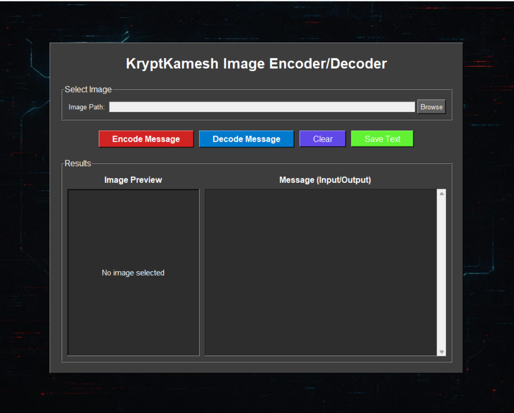
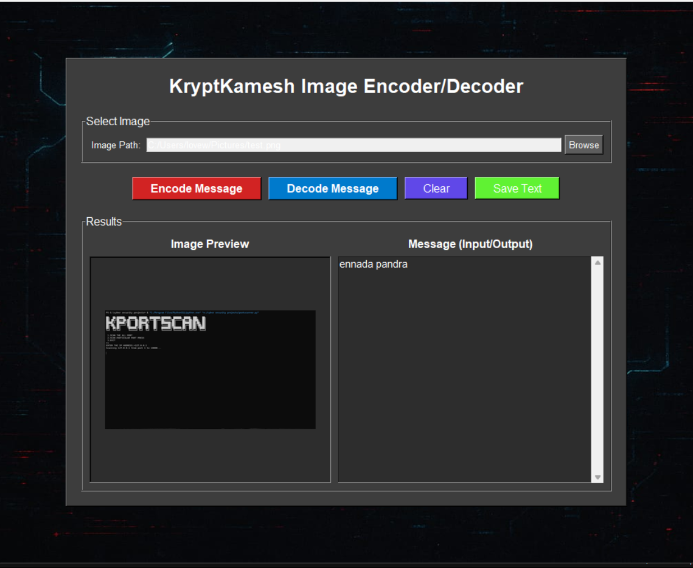

# 🕵‍♂ Steganography Tool - Encoder & Decoder by Kamesh the Hacker

A simple Python-based steganography tool to *hide and extract secret messages* inside images. No encryption is used — pure LSB (Least Significant Bit) steganography!

---

## 📸 Features

- 🔐 Encode text inside image pixels
- 🔓 Decode hidden messages from images
- 🖼 PNG image support
- 🧑‍💻 Built with Python & Tkinter GUI
- 🎨 Dark-themed GUI with hacker-style font

---

## 📦 Installation Guide

### 1️⃣ Clone the Repository
```bash
git clone https://github.com/kamesh-the-hacker/krypt0kamesh.git
cd krypt0kamesh
```

2️⃣ Set Up Python Environment

Make sure you have Python 3.8+ installed.

3️⃣ Install Required Libraries
```bash
pip install pillow
```
> If you're using custom fonts, just place the .ttf file in your project directory.


---

🚀 Usage

Run the GUI tool:

python steganography.py

🔧 Encoder:

Load an image

Type your secret message

Save the encoded image


🔍 Decoder:

Load the encoded image

Extract the hidden message


---
🏃Run Command
```bash
python steganography.py
```
📁 Files

stenography.py → Main GUI script

README.md → Project description

VT323-Regular.ttf (optional) → Hacker-style font

screenshot.png (optional) → GUI preview


---

🖼 Screenshot






---

👨‍💻 Author

Kamesh the Hacker
🔗 GitHub: @kamesh-the-hacker


---

⚠ Disclaimer

This tool is for educational and ethical use only. Do not use it for illegal or malicious purposes.


---

📜 License

MIT License

---

Would you like me to generate a requirements.txt and GitHub tags (topics) for your repo as well?
